<a href="https://ask.divyanshmalani.com">
  
</a>

<p align="center">
  <a href="https://ask.divyanshmalani.com"></a>
  <a href="https://www.neorunners.net"></a>
  <a href="https://divyanshmalani.com"></a>
  <a href="https://linkedin.com/in/divyanshmalani"></a>
  <a href="mailto:info@divyanshmalani.com"></a>
</p>

<br />



Full stack dev from Jaipur. I make things pretty to look at, and I make sure the parts you can't see work just as neatly, so your data stays yours and nothing falls over the moment you actually need it.

By night I'm an **SDE at BITCS** on US hours, shipping agentic AI products end to end for clients whose products see around **5 million daily active users**. By day I'm building **[NeoRunners](https://www.neorunners.net)**, a real-time PvP game in a stack I had never touched. Everyone builds a dashboard. I built a game.

<br />


<p align="center">
  <a href="https://www.neorunners.net"></a>
  <a href="https://risecv.com"></a>
</p>
<p align="center">
  <a href="https://ask.divyanshmalani.com"></a>
  <a href="https://github.com/itzdiv/SensAI"></a>
</p>

**Also shipped**

- **HireMe**: a job platform with recruiter and candidate dashboards, JWT auth, job posting flows and application tracking.
- **[divyanshmalani.com](https://divyanshmalani.com)**: my portfolio, built with zero AI agents. Just me, Google and the problem.
- **[mobile-game-engineering](https://github.com/itzdiv/mobile-game-engineering)**: an engineering doctrine skill that teaches AI coding agents to build multiplayer browser games properly.
- **Shoptics**: a portfolio and membership platform for photographers. Client work, so that's all you get. NDA.

<br />


```console
$ git log --author="divyansh" --graph --career

* 2026.01 → now   BITCS · Software Development Engineer · full-time, remote
│                 RiseCV, HireMe and 3+ internal products, spec to deploy
│                 LLM router: 60%+ of requests skip the model, -70% tokens per call
│                 SSR / ISR / RSC picked per route: -30% client bundle, Lighthouse in the 90s
│                 telemetry + structured logs on every critical API path
│
* 2025.06 → 07    Indian Railway Protection Force · Full Stack Developer Intern · New Delhi
│                 React + Django module live across 16 battalions, 50,000+ records
│                 RBAC, legacy Laravel/PHP bridged over REST, same-day fixes from on-site feedback
│
* 2024.06 → 07    Hamari Pahchan NGO · Virtual Intern
│                 design, digital marketing, crowdfunding. officially certified "inquisitive"
│
* 2023 → 2026     HackHound, SRMIST · Core Developer
│                 ran hackathons and workshops for 150+ students
│
* 2022.11 → 12    Netcamp Solutions · Android Developer Intern
                  Java, Android Studio, Firebase auth. where it all clicked

$ cat ~/education
B.Tech CSE · SRM Institute of Science and Technology · 2022 → 2026 · CGPA 9.34

$ ls ~/certs
oci-generative-ai-developer.cert    nptel-cloud-computing-elite-silver.cert
```

<br />


<div align="center">
<table>
  <tr>
    <td align="right"><b>languages</b></td>
    <td></td>
  </tr>
  <tr>
    <td align="right"><b>frontend</b></td>
    <td></td>
  </tr>
  <tr>
    <td align="right"><b>backend</b></td>
    <td></td>
  </tr>
  <tr>
    <td align="right"><b>data</b></td>
    <td></td>
  </tr>
  <tr>
    <td align="right"><b>ship</b></td>
    <td></td>
  </tr>
  <tr>
    <td align="right"><b>AI</b></td>
    <td>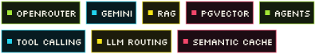</td>
  </tr>
</table>
</div>

<br />


<p align="center">
  
  
</p>
<p align="center"><sub>most of my code ships from private company repos, so this is the tip of it</sub></p>

<picture>
  <source media="(prefers-color-scheme: dark)" srcset="https://raw.githubusercontent.com/itzdiv/itzdiv/output/snake-dark.svg" />
  
</picture>

<br />


**quest log**

- [x] 30k YouTube subs and millions of views by 2022. no, you're not getting the channel
- [x] top 5 out of ~100 teams with a team of two
- [x] internship to full-time at BITCS
- [x] a real-time PvP game, in a stack I had never touched
- [x] a portfolio that talks back
- [ ] get humanity to a Type 1 civilization

**off the clock**

- gym 5 to 6 times a week. protein is not optional
- Chivalry 2 is the GOAT. swords, no guns, proper medieval chaos
- weekend chef, manhwa reader, retired anime kid
- tools I swear by: [Warp](https://www.warp.dev), [Wispr Flow](https://wisprflow.ai), [Cloudflare WARP](https://one.one.one.one)

**hot take**

> We should ban AI and write the code ourselves to get rid of the slop.
>
> Yes, from a guy who uses AI every day. It's about the order: I type it out and learn it first, then AI gets the boring repetition.

<br />


<p align="center">
  Recruiters, clients, people with a crazy idea: just send it. No perfect pitch needed, I reply within a day.<br />
  <sub>Not taking referral requests or free work. Everything else, I'm all ears.</sub>
</p>

<p align="center">
  <a href="mailto:info@divyanshmalani.com"></a>
  <a href="https://linkedin.com/in/divyanshmalani"></a>
  <a href="https://instagram.com/itzdiv"></a>
  <a href="https://ask.divyanshmalani.com"></a>
</p>

<br />

<a href="https://www.neorunners.net">
  
</a>

<p align="center">
  
</p>
